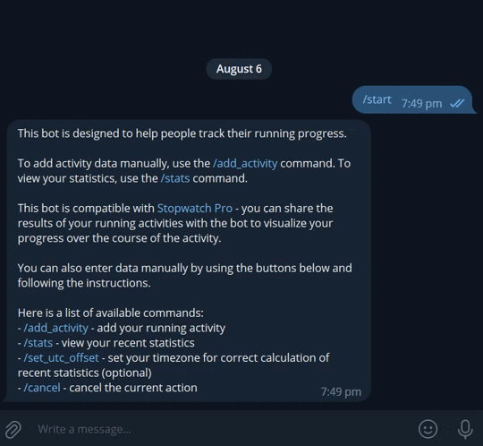

# Run tracker


This is a telegram bot for storing running activities and tracking your progress.

## Example


## Usage

- open the bot at [this link](https://t.me/bot_untaken_bot)
- follow the bot instructions

## Deployment

### Local

- Clone the repository
- Run `pip install -r requirements.txt`
- Create `.env` file in the root repo directory with the following string:
  `BOT_TOKEN = <YOUR_TOKEN>`
- Run `python -m bot.py`

### Docker

#### Using Hub image

```
docker pull nidetag/run-tracker
```
```
docker run --name run-tracker -d -e TOKEN=<YOUR_TOKEN> nidetag/run-tracker
```

#### Building image

```
docker build -t run-tracker .
```
```
docker run --name run-tracker -d -e TOKEN=<YOUR_TOKEN> run-tracker
```
